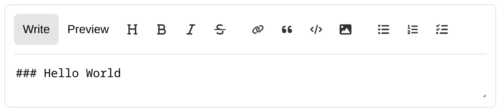

# React Markdown Editor (Function Component version)

> Features: Hooks, FC, Styled-components, no extra css file, support custom button commands, support i10n or l18n

# TESTING, DO NOT USE IT.

# SCREENSHOT



# DEMO

[Codesandbox demo](https://codesandbox.io/s/intelligent-edison-ikf8hf?file=/src/App.tsx)

# INSTALL

```
npm i fc-mde
```

# USAGE

```
import { useRef, useState } from 'react';
import Showdown from 'showdown';
import { Mde, MdeTabProps } from 'fc-mde';

export const App = () => {
  const [value, setValue] = useState('### Hello World');
  const refTextarea = useRef<HTMLTextAreaElement>(null);
  const [tab, setTab] = useState<MdeTabProps>('write');
  const converter = new Showdown.Converter({
    tables: true,
    simplifiedAutoLink: true,
    strikethrough: true,
    tasklists: true,
  });
  const handleValueChange = (value: string) => {
    setValue(value);
  };
  const handleTabChange = (tab: MdeTabProps) => {
    setTab(tab);
  };
  return (
    <Mde
      text={value}
      setText={handleValueChange}
      onTabChange={handleTabChange}
      refTextarea={refTextarea}
      generateMarkdownPreview={async (markdown) => {
        return converter.makeHtml(markdown);
      }}
      selectedTab={tab}
    />
  );
};
```

# TODO

- [ ] Add paste image to basee64 format.
- [ ] Add upload image to base64 format.
- [ ] Add suggestion.
- [ ] Add light / dark theme.
